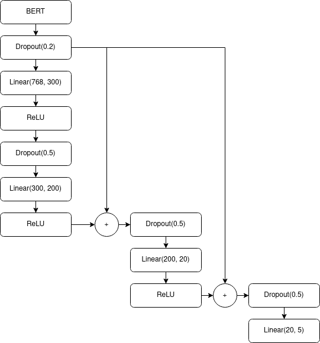

# Re:Summary

Deep learning project on summarizing multiple Amazon reviews of a product into keywords and presenting them in a word cloud.

## Authors
Authors are ordered alphabetically by last name.
- Yuying Fan ([@fyy26](https://github.com/fyy26))
- Rehaan Furniturewala ([@r3khaan](https://github.com/r3khaan))
- Andrew Raine ([@andrewlr09](https://github.com/andrewlr09))

## Problem of Interest
Even though online shoppers have thousands of reviews to learn about each product, they lack the time to read each review and make the optimal purchasing decision.

## Dataset
We used a dataset of [Amazon Reviews](https://nijianmo.github.io/amazon/index.html) from a research group at the University of California San Diego. The dataset that we are able to access, a “small” subset of the full set, contains 75,257,650 reviews that we can train on.

Each review is of the format: `(overall_score, verified_purchase, review_time, reviewer_id, product_id, style, reviewer_name, review_text, summary)`.

We used a BERT tokenizer across all our models for generating word embeddings.

## Methods
1. Build a classification model that predicts the star-rating (1-5) of a review based on its text.
2. Run part-of-speech tagging on each review using the NLTK library.
3. For each adjective in a given review, replace the adjective with BERT's `[MASK]` token to produce a masked review.
4. Run each masked review through the star-rating prediction model and compute the difference in the predicted star-rating between the original and masked review.
5. Collect the few adjectives with the biggest difference to generate a summary word cloud.

### Non-DL Benchmark for Start-Rating Prediction
Random forest with 100 estimators; validation accuracy of 20.93% after training on 90% of the data (no better than a random classifier).
```
forest = sklearn.ensemble.RandomForestClassifier(n_estimators=100)
```
### DL Benchmark for Star-Rating Prediction
Stacked RNN with 5 layers and a hidden size of 50, followed by a linear output layer; best validation accuracy of 39.65%.
### Our DL Model for Star-Rating Prediction
Built on top of a pre-trained BERT; validation accuracy in the low 60% after removing bias.



## Read More
### [Technical Report](Technical_Report/CIS522_Re_Summary.pdf)
### [Colab Doc](522_Project.ipynb)
